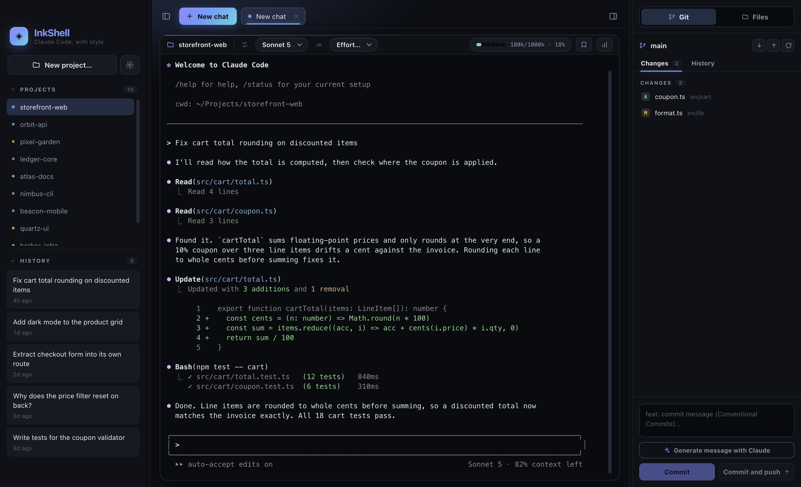
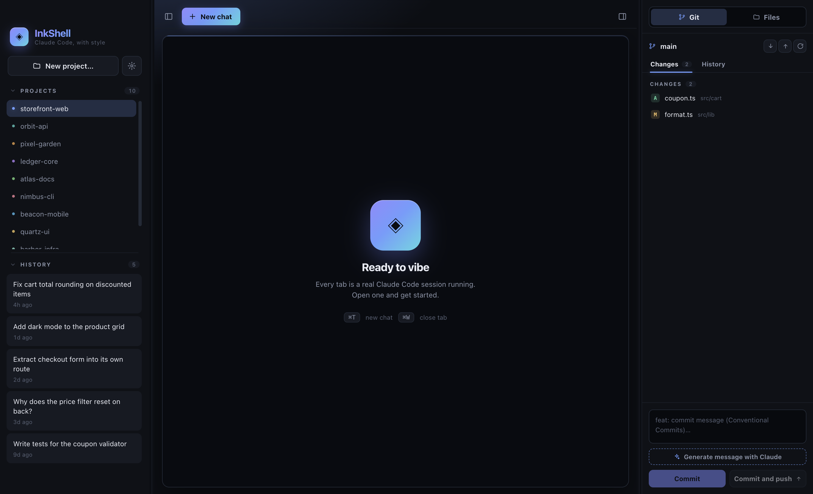
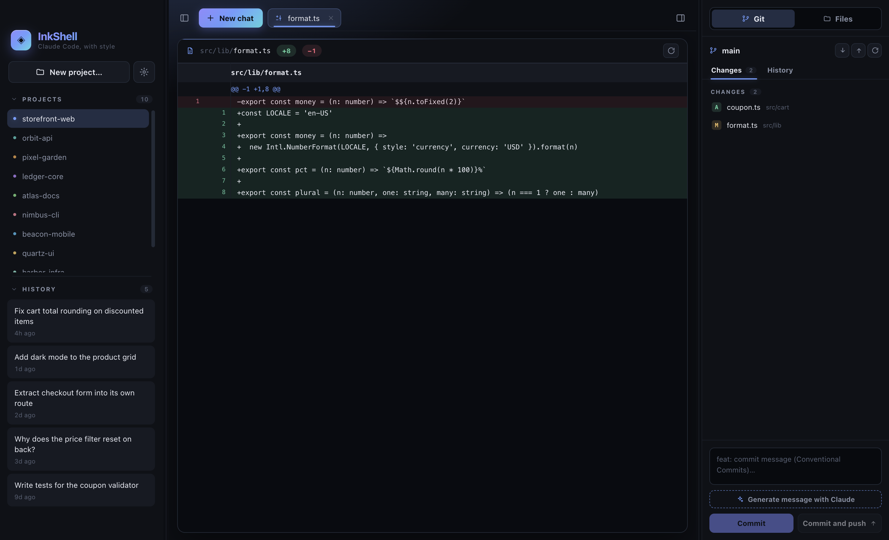
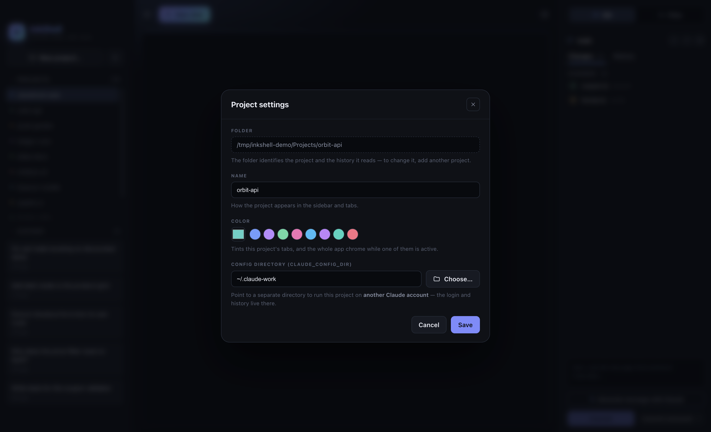
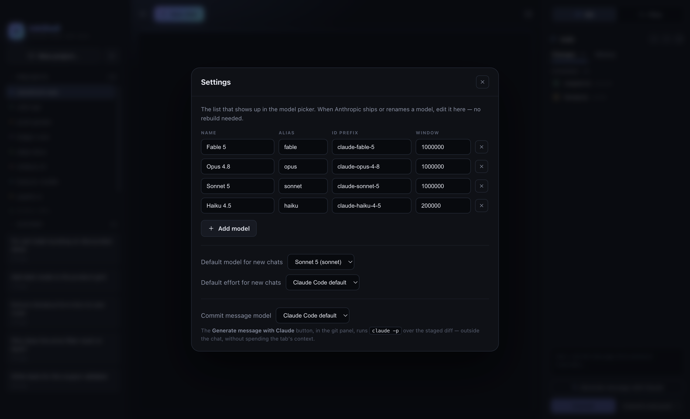

<div align="center">

# ◈ InkShell

**A tabbed desktop workspace for [Claude Code](https://docs.claude.com/en/docs/claude-code). The CLI, with style.**

[](./LICENSE)
[](https://www.electronjs.org/)
[](./CONTRIBUTING.md)



</div>

---

InkShell is for people who already live in the `claude` CLI and have no intention
of leaving it, but who juggle several projects at once and want a desktop around
them. Every session in a tab, every project in one window, each with its own
configuration, so work and personal never share credentials or history and
switching between them costs nothing.

It stays a thin shell around the real thing. InkShell never reimplements Claude
Code: it spawns your own locally-installed `claude` inside a pseudo-terminal, so
you are always running the **original, stable CLI**, and a feature reaches you the
day it ships to the terminal rather than whenever we catch up. No fork, no
repackaged binary, no version lag. Close InkShell and your CLI is exactly where
you left it.

> InkShell is a community project and is **not affiliated with Anthropic**.
> "Claude" and "Claude Code" are trademarks of Anthropic.

## ✨ Features

- **Tabbed sessions**: run several Claude Code chats side by side, each its own
  process, with `⌘T` / `⌘W` to open and close.
- **Projects & history**: pick any folder as a working directory; InkShell reads
  Claude Code's own transcript store (`~/.claude/projects`) to list and resume
  past sessions.
- **Per-project configuration**: each project carries an accent color that tints
  the chrome and every tab belonging to it, plus its own Claude config directory
  (`CLAUDE_CONFIG_DIR`). Point a project at a separate config dir and its sessions,
  history, and context meter all follow it. No shell aliases, no `.envrc` juggling.
- **Live model switcher**: one tap types `/model <alias>` into the session.
  The model list is fully editable in Settings, so a newly released model is a
  config edit, not a new release.
- **Context meter**: a fuel gauge that mirrors the CLI's context indicator,
  reading the live token count from the active session's transcript.
- **Git panel**: stage, unstage, commit, and push without leaving the window;
  browse branch history and open any diff, file, or commit as a viewer tab.
  Commit messages can be drafted by Claude with one click.
- **File browser**: the project's tree in the same dock, with modified files
  marked, so you can open a file next to the session that's editing it.
- **Analytics & memory shortcuts**: quick access to `/stats` and (soon) a
  memory viewer.
- **Seamless, frameless UI**: floating traffic lights on macOS, custom window
  controls elsewhere, and the "Midnight Ink" dark theme throughout: cool graphite
  chrome, an iris accent, and a per-model hue so you always know which Claude
  you're talking to.

## 🖼️ A look around

<table>
  <tr>
    <td width="50%">
      
      <sub><b>Projects &amp; history</b> — every project in one window, each with its own accent color, and the past sessions of whichever one is selected.</sub>
    </td>
    <td width="50%">
      
      <sub><b>Diffs as tabs</b> — open any changed file, commit, or diff from the git panel and read it beside the session that wrote it.</sub>
    </td>
  </tr>
  <tr>
    <td width="50%">
      
      <sub><b>Per-project settings</b> — name, accent color, and the Claude config directory this project runs against.</sub>
    </td>
    <td width="50%">
      
      <sub><b>Settings</b> — the model picker's list is editable, so a newly released model is a config edit rather than a new release.</sub>
    </td>
  </tr>
</table>

## 📦 Requirements

- **[Claude Code](https://docs.claude.com/en/docs/claude-code)** installed and
  on your `PATH` (the `claude` command must run from a terminal).
- **Node.js ≥ 20** and npm to build from source.

## 📥 Install (macOS)

```bash
curl -fsSL https://raw.githubusercontent.com/inkshell/inkshell/main/install.sh | bash
```

That downloads the [latest release](https://github.com/inkshell/inkshell/releases/latest)
for your Mac — Apple Silicon or Intel — and installs it into `/Applications`.

Why a script and not a plain download? InkShell builds aren't code-signed yet,
and macOS quarantines anything a **browser** downloads, so opening the app that
way greets you with a misleading *"InkShell is damaged and can't be opened"*
dialog. `curl` downloads are never quarantined, so the script installs an app
that just opens. (You can [read the script](./install.sh) first — it's ~70
lines of `sh`.)

<details>
<summary>Installing by hand instead</summary>

Download the `.zip` for your architecture from the
[Releases page](https://github.com/inkshell/inkshell/releases/latest), unzip it,
move `InkShell.app` to `/Applications`, then clear the quarantine flag your
browser attached to the download:

```bash
xattr -dr com.apple.quarantine /Applications/InkShell.app
```

Without that last step, macOS shows the "damaged" dialog above — the file is
fine; the message is Gatekeeper's way of saying "unsigned and quarantined".

</details>

## 🚀 Getting started

```bash
# 1. Clone
git clone https://github.com/inkshell/inkshell.git
cd inkshell

# 2. Install (also rebuilds the native node-pty module for Electron)
npm install

# 3. Run in development (hot reload)
npm run dev
```

To produce a distributable app for your platform:

```bash
npm run pack:mac     # .zip
npm run pack:win     # NSIS installer
npm run pack:linux   # AppImage + .deb
```

## 🧠 How it works

InkShell is a standard three-process Electron app:

| Process      | Responsibility                                                                 |
| ------------ | ------------------------------------------------------------------------------ |
| **main**     | Spawns `claude` in a pseudo-terminal (`node-pty`), reads config & history, owns the window. |
| **preload**  | A tiny `contextBridge` exposing a typed, sandboxed `window.inkshell` API.        |
| **renderer** | React UI: tabs, sidebar, toolbar, and an `xterm.js` view per session.          |

See [`docs/ARCHITECTURE.md`](./docs/ARCHITECTURE.md) for the full picture.

## 🎨 Theming

Every color, radius, and glow lives in CSS variables at the top of
[`src/renderer/src/styles/theme.css`](./src/renderer/src/styles/theme.css).
Re-theming InkShell is a one-file edit.

## 🗺️ Roadmap

Today InkShell speaks **Claude Code**, and only Claude Code. The design doesn't
depend on that, though: the app drives a real CLI agent inside a pseudo-terminal
and reads the transcripts that agent already writes, which is a shape more than
one tool fits.

**Codex** and **GitHub Copilot** are the next targets. The goal isn't a lowest
common denominator across all three, but one window where each project opens the
agent it actually calls for.

## 🤝 Contributing

Contributions are very welcome. See [CONTRIBUTING.md](./CONTRIBUTING.md) and our
[Code of Conduct](./CODE_OF_CONDUCT.md). Good first issues are labeled
[`good first issue`](https://github.com/inkshell/inkshell/labels/good%20first%20issue).

## 📄 License

Licensed under the [Apache License 2.0](./LICENSE). See [NOTICE](./NOTICE) for
attribution and trademark details.
