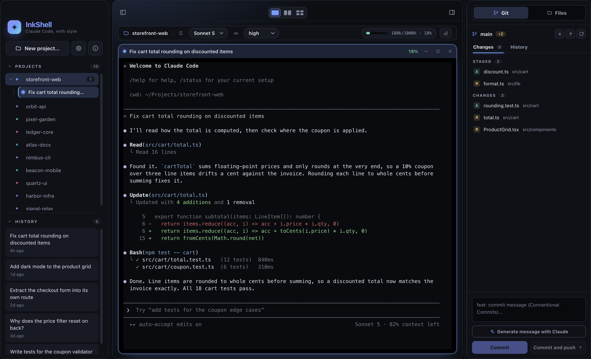
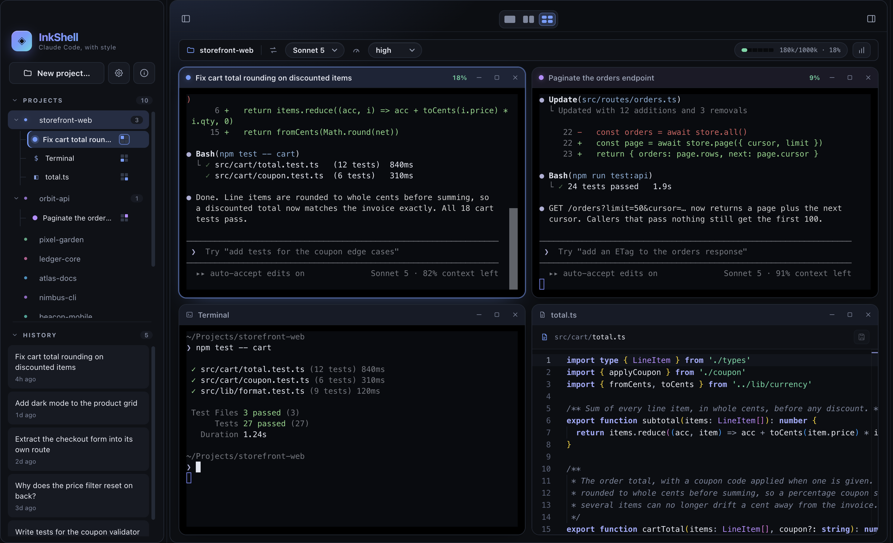
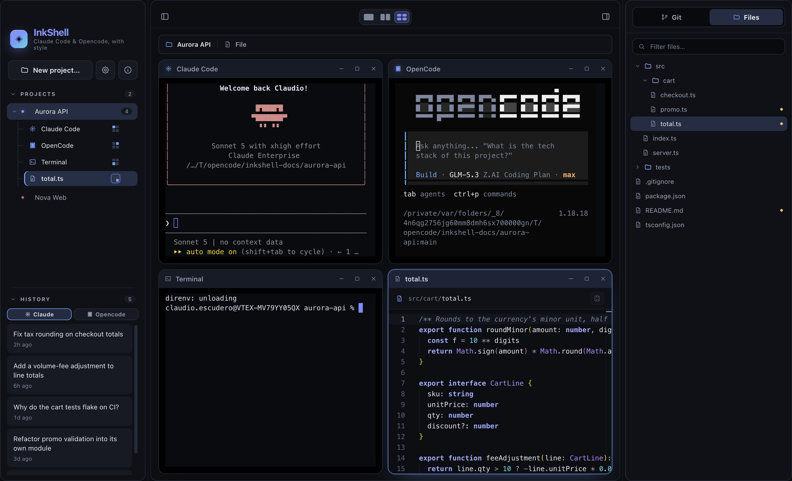
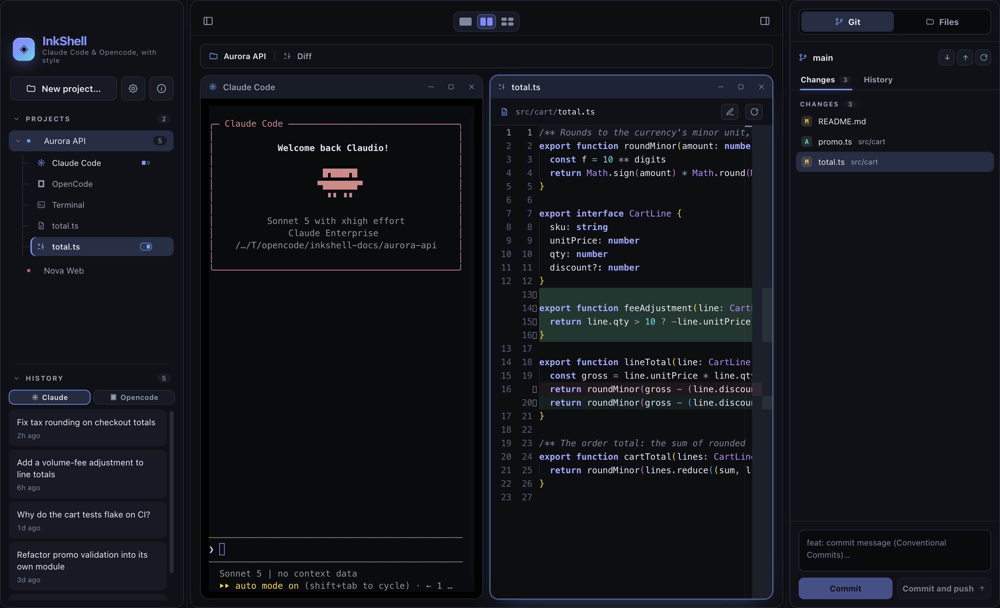
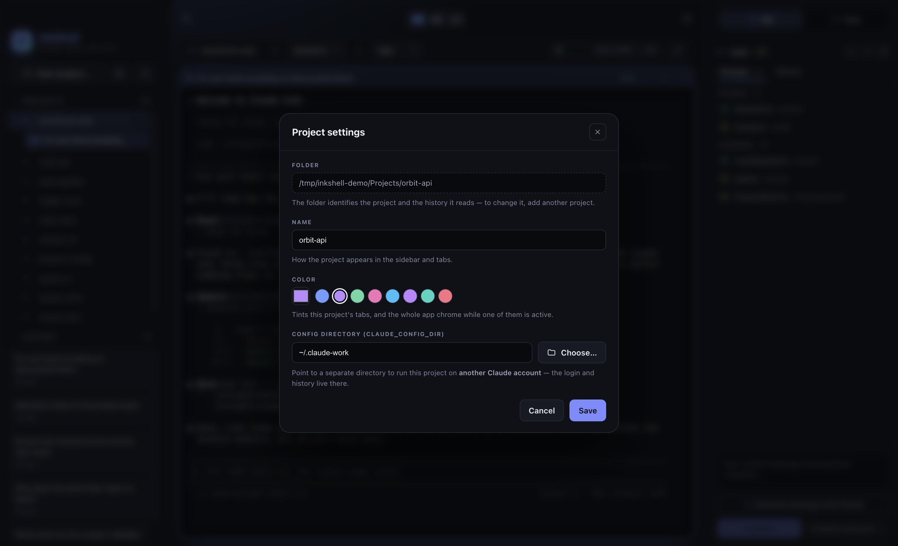
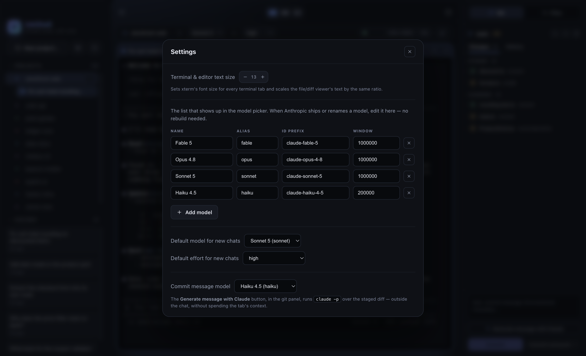

<div align="center">

# ◈ InkShell

**A tabbed desktop workspace for [Claude Code](https://docs.claude.com/en/docs/claude-code). The CLI, with style.**

[](./LICENSE)
[](https://www.electronjs.org/)
[](./CONTRIBUTING.md)



</div>

---

InkShell is for people who already live in the `claude` CLI and have no intention
of leaving it, but who juggle several projects at once and want a desktop around
them. Every session in a pane, every project in one window, each with its own
configuration, so work and personal never share credentials or history and
switching between them costs nothing.

It stays a thin shell around the real thing. InkShell never reimplements Claude
Code: it spawns your own locally-installed `claude` inside a pseudo-terminal, so
you are always running the **original, stable CLI**, and a feature reaches you the
day it ships to the terminal rather than whenever we catch up. No fork, no
repackaged binary, no version lag. Close InkShell and your CLI is exactly where
you left it.

> InkShell is a community project and is **not affiliated with Anthropic**.
> "Claude" and "Claude Code" are trademarks of Anthropic.

## ✨ Features

- **A split workspace, not a tab strip**: show **1, 2 or 4 panes** at once and
  drag a chat from the sidebar — or from another pane — into any of them. Panes
  minimize and maximize without touching the process behind them, so a session you
  push off-screen keeps running and comes back exactly as you left it.
- **Every project in one window**: the sidebar is a tree — each project, with its
  open chats, terminals and files nested underneath, a badge showing which pane
  each one currently sits in, and drag-to-reorder for the list itself. Any project
  row starts a chat or a terminal **in that project** in one click, whether or not
  it's the one currently selected.
- **History that is Claude Code's own**: InkShell reads the CLI's transcript store
  (`~/.claude/projects`) to list past sessions, names each one with the same
  `ai-title` the CLI uses, resumes it in a pane, or deletes it from the list.
- **Per-project configuration**: each project carries an accent color that tints
  the chrome and every pane belonging to it, plus its own Claude config directory
  (`CLAUDE_CONFIG_DIR`). Point a project at a separate config dir and its sessions,
  history, and context meter all follow it. No shell aliases, no `.envrc` juggling.
- **Plain terminals, same window**: open your own `$SHELL` in the project
  directory as just another pane — for the `git rebase` or the dev server you
  didn't want to spend a chat on.
- **Model & effort switchers**: one pick types `/model` or `/effort` into the live
  session. The model shown is the one actually backing it, read from the
  transcript rather than guessed.
- **Context meter**: a fuel gauge that mirrors the CLI's context indicator, live
  from the active session's transcript, measured against that model's own context
  window. Every pane carries its own reading in its title bar.
- **Git panel**: stage, unstage, commit, and push without leaving the window;
  browse the branch history with unpushed commits marked, and open any diff, file
  or commit as a pane of its own. Commit messages can be drafted by Claude with
  one click.
- **Files, diffs, and a real editor**: the project's tree with modified files
  marked, files opening in a **Monaco** editor you can actually edit and save, and
  diffs and commits rendered as Monaco diffs. A single click peeks at a file, a
  double click pins it. File paths Claude mentions in its output are clickable —
  verified against the disk, so only real files light up.
- **Quick Open**: fuzzy-search every file in the active project and open it
  straight into the editor.

## 🖼️ A look around



<sub><b>Four panes, one window</b> — two chats from different projects, a terminal, and a file in the editor. Drag any of them between panes; what you push off-screen keeps running.</sub>

<table>
  <tr>
    <td width="50%">
      
      <sub><b>Projects &amp; history</b> — every project in one tree, its open items nested underneath, and the past sessions of whichever one is selected.</sub>
    </td>
    <td width="50%">
      
      <sub><b>Diffs as panes</b> — open any changed file, commit, or diff from the git panel and read it beside the session that wrote it.</sub>
    </td>
  </tr>
  <tr>
    <td width="50%">
      
      <sub><b>Per-project settings</b> — name, accent color, and the Claude config directory this project runs against.</sub>
    </td>
    <td width="50%">
      
      <sub><b>Settings</b> — the model list is editable (name, alias, id prefix, context window), so a newly released model is a config edit rather than a new release.</sub>
    </td>
  </tr>
</table>

## ⌨️ Shortcuts

| Keys                | Action                                                         |
| ------------------- | -------------------------------------------------------------- |
| `⌘T` / `Ctrl+T`     | New chat in the selected project                                |
| `⌘W` / `Ctrl+W`     | Minimize the focused pane (the session keeps running)           |
| `⌘P` / `Ctrl+P`     | Quick Open — fuzzy file search in the active project            |
| `⌘S` / `Ctrl+S`     | Save the file open in the editor                                |
| Middle click        | On a pane: minimize it · on a sidebar item: close it            |
| Right click         | On a project: its settings · on a history card: delete the chat |

## 📦 Requirements

- **[Claude Code](https://docs.claude.com/en/docs/claude-code)** installed (the
  `claude` command must run in your terminal). InkShell asks your login shell
  where it is and also checks the usual install locations, so it still finds the
  CLI when the app is opened from the Finder with a truncated `PATH`. A
  non-standard install can be pointed at directly with `INKSHELL_CLAUDE_BIN`.
- **Node.js ≥ 20** and npm to build from source.

## 📥 Install (macOS)

```bash
curl -fsSL https://raw.githubusercontent.com/inkshell/inkshell/main/install.sh | sh
```

That downloads the [latest release](https://github.com/inkshell/inkshell/releases/latest)
— a universal build that runs on Apple Silicon or Intel — and installs it into
`/Applications` (or `~/Applications` when that isn't writable).

> A **Windows version is coming soon.** Until it lands, Windows and Linux users
> can run InkShell from source — see [Getting started](#-getting-started) below.

Why a script and not a plain download? InkShell builds aren't code-signed yet,
and macOS quarantines anything a **browser** downloads, so opening the app that
way greets you with a misleading *"InkShell is damaged and can't be opened"*
dialog. `curl` downloads are never quarantined, so the script installs an app
that just opens. (You can [read the script](./install.sh) first — it's ~70
lines of `sh`.)

<details>
<summary>Installing by hand instead</summary>

Download the `.zip` from the
[Releases page](https://github.com/inkshell/inkshell/releases/latest), unzip it,
move `InkShell.app` to `/Applications`, then clear the quarantine flag your
browser attached to the download:

```bash
xattr -dr com.apple.quarantine /Applications/InkShell.app
```

Without that last step, macOS shows the "damaged" dialog above — the file is
fine; the message is Gatekeeper's way of saying "unsigned and quarantined".

</details>

## 🚀 Getting started

```bash
# 1. Clone
git clone https://github.com/inkshell/inkshell.git
cd inkshell

# 2. Install (also rebuilds the native node-pty module for Electron)
npm install

# 3. Run in development (hot reload)
npm run dev
```

To produce a distributable app for your platform:

```bash
npm run pack:mac     # .zip
npm run pack:win     # NSIS installer
npm run pack:linux   # AppImage + .deb
```

macOS is the only target that ships today. The Windows and Linux builds are
wired up but **haven't been tested yet** — if you try one, an issue (or a PR)
telling us how it went is very welcome.

## 🧠 How it works

InkShell is a standard three-process Electron app:

| Process      | Responsibility                                                                              |
| ------------ | ------------------------------------------------------------------------------------------- |
| **main**     | Spawns `claude` (or your `$SHELL`) in a pseudo-terminal (`node-pty`), reads config & history, drives git, owns the window. |
| **preload**  | A tiny `contextBridge` exposing a typed, sandboxed `window.inkshell` API.                     |
| **renderer** | React UI: the pane grid, sidebar tree, git/files dock, an `xterm.js` view per session and a Monaco editor per file. |

Two rules the code holds to: the renderer never touches the OS except through
the typed IPC contract in `src/shared`, and Claude Code's own data is **read,
never written** — `~/.claude/projects` is the CLI's, InkShell keeps its own
config in `~/.inkshell/config.json`.

See [`docs/ARCHITECTURE.md`](./docs/ARCHITECTURE.md) for the full picture.

## 🎨 Theming

Every color, radius, and glow lives in CSS variables at the top of
[`src/renderer/src/styles/theme.css`](./src/renderer/src/styles/theme.css).
Re-theming InkShell is a one-file edit.

## 🗺️ Roadmap

Today InkShell speaks **Claude Code**, and only Claude Code. The design doesn't
depend on that, though: the app drives a real CLI agent inside a pseudo-terminal
and reads the transcripts that agent already writes, which is a shape more than
one tool fits.

**Codex** and **GitHub Copilot** are the next targets. The goal isn't a lowest
common denominator across all three, but one window where each project opens the
agent it actually calls for.

## 🤝 Contributing

Contributions are very welcome. See [CONTRIBUTING.md](./CONTRIBUTING.md) and our
[Code of Conduct](./CODE_OF_CONDUCT.md). Good first issues are labeled
[`good first issue`](https://github.com/inkshell/inkshell/labels/good%20first%20issue).

## 📄 License

Licensed under the [Apache License 2.0](./LICENSE). See [NOTICE](./NOTICE) for
attribution and trademark details.
